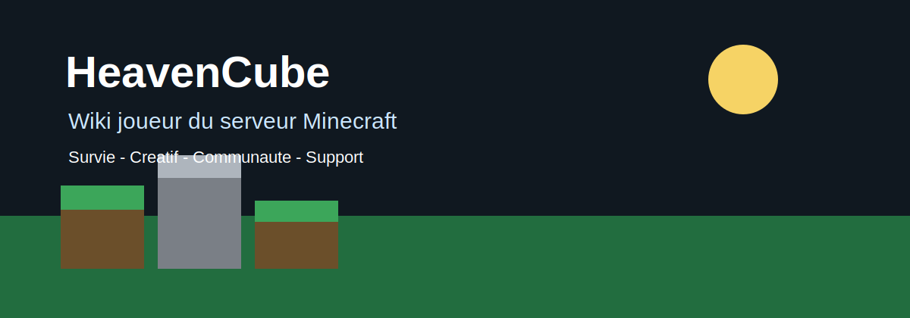

# Wiki HeavenCube

Bienvenue sur le wiki de HeavenCube, le point de repere pour comprendre le serveur, trouver les commandes utiles et avancer sans se perdre.

[!badge text="Wiki joueur" variant="primary" icon="book"]
[!badge text="Informations a confirmer si marquees TODO" variant="warning" icon="alert"]
[!badge text="Serveur Minecraft" variant="success" icon="server"]

!!!warning Donnees serveur a confirmer
Le depot ne contient pas encore les valeurs officielles comme l'adresse de connexion, la version Minecraft, la liste exacte des commandes, les prix, les recompenses ou les permissions. Chaque mecanique non confirmee est marquee avec un `TODO`.
!!!

## Arborescence proposee

:::code source="includes/arborescence.txt" title="Arborescence complete du wiki" :::

## Prerequis

- [ ] Avoir Minecraft installe.
- [ ] Connaitre la version acceptee par le serveur. **TODO : confirmer la version Minecraft officielle.**
- [ ] Lire les [reglements](reglements.md) avant de commencer.
- [ ] Rejoindre les canaux utiles, notamment [Discord](utilitaire/discord.md) si disponible.

## Commandes utiles

| Commande | Utilisation | Statut |
| --- | --- | --- |
| `/help` | Afficher l'aide en jeu. | [!badge A confirmer\|warning] |
| `/spawn` | Revenir au point central du serveur. | [!badge A confirmer\|warning] |
| `/rules` | Consulter les regles en jeu. | [!badge A confirmer\|warning] |
| `/discord` | Obtenir le lien Discord. | [!badge A confirmer\|warning] |

## Guide etape par etape

>>> Lire l'essentiel
Commence par la page [Rejoindre HeavenCube](rejoindre.md), puis garde la page [Premiers pas](premiers-pas.md) ouverte pendant ta premiere session.

>>> Choisir une activite
Va vers [Survie](survie/index.md) pour progresser, construire, economiser et proteger tes zones, ou vers [Creatif](creatif/index.md) pour construire librement.

>>> Demander de l'aide
Si une information manque ou semble incorrecte, utilise la page [Support](utilitaire/support.md) ou propose une correction via [Contribuer](contributeurs/contribuer.md).
>>>

## Conseils pratiques

!!!tip Bien demarrer
Lis les pages dans l'ordre `Rejoindre` -> `Premiers pas` -> `Reglements` -> mode de jeu choisi. Cela evite la plupart des erreurs de debut.
!!!

+++ Nouveaux joueurs
- Garde les commandes essentielles dans un bloc-notes.
- Demande confirmation avant de construire pres d'un autre joueur.
- Fais une capture d'ecran si tu rencontres un bug.
+++ Joueurs reguliers
- Consulte les pages [Evenements](survie/evenements.md), [Vote](utilitaire/vote.md) et [Classements](survie/classements.md) pour suivre l'activite.
- Signale les TODO confirmes a l'equipe de documentation.
+++

## FAQ

!!!question Le wiki est-il complet ?
Pas encore. Les pages sont structurees pour accueillir les informations officielles au fur et a mesure.
!!!

!!!question Puis-je corriger une page ?
Oui. Consulte [Contribuer au wiki](contributeurs/contribuer.md) et le [Guide de style](contributeurs/style-guide.md).
!!!

!!!question Les commandes marquees TODO fonctionnent-elles ?
Elles doivent etre confirmees par l'equipe serveur avant d'etre considerees comme officielles.
!!!

## Pages liees

[!button text="Rejoindre le serveur" icon="sign-in"](rejoindre.md)
[!button text="Premiers pas" icon="rocket"](premiers-pas.md)
[!button text="Survie" icon="package"](survie/index.md)
[!button text="Support" icon="comment-discussion"](utilitaire/support.md)

[!backlinks "Pages qui renvoient vers l'accueil"]
